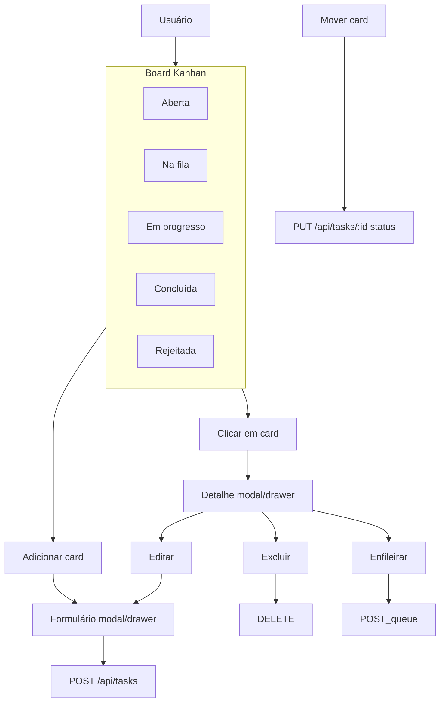

# Jornada do usuário – Board Kanban (estilo Trello)

Este documento descreve a jornada do usuário para a experiência principal do Agent Coder: um board Kanban com colunas por status, cards arrastáveis e overlays para criar, ver detalhe e editar tarefas. A experiência de lista por rotas continua documentada em [jornada-usuario-tarefas.md](jornada-usuario-tarefas.md); o Kanban passa a ser a vista principal.

---

## 1. Persona e objetivos

### Quem

Pessoa que gerencia tarefas que serão processadas pelo agente (worker). Precisa ver o estado do pipeline (aberta → fila → em progresso → concluída ou rejeitada) e agir rápido: criar tarefas, mover entre estágios, ver detalhe, enfileirar para o worker.

### Objetivos

1. **Ver todas as tarefas por estágio** num só lugar (board com 5 colunas).
2. **Mover tarefas entre estágios** por arrastar-e-soltar ou por ações no detalhe.
3. **Criar, editar e ver detalhe** sem sair do board (overlays: modal ou drawer).
4. **Enfileirar** tarefas abertas para o worker (botão no detalhe ou arrastar para “Na fila”).

---

## 2. Cenários de uso (fluxos)

| Cenário | Ação do usuário | Sistema | Resultado |
|--------|------------------|---------|-----------|
| **Entrada** | Acessa o app | GET /api/tasks | Board com 5 colunas (Aberta, Na fila, Em progresso, Concluída, Rejeitada); cards distribuídos por status. |
| **Ver pipeline** | Olha o board | - | Visão única do fluxo; cards listados por coluna. |
| **Criar tarefa** | Clica em “Adicionar card” numa coluna (ex.: Aberta) | Abre formulário em overlay | POST /api/tasks com status da coluna; card aparece na coluna. |
| **Ver detalhe** | Clica em um card | Abre detalhe em overlay | GET /api/tasks/:id; título, status, corpo em Markdown; ações Editar, Excluir, Enfileirar (se open). |
| **Mover tarefa (drag)** | Arrasta card para outra coluna | - | PUT /api/tasks/:id com novo status; card muda de coluna. |
| **Enfileirar** | No detalhe de tarefa aberta, clica “Enfileirar” | POST /api/tasks/:id/queue | Status → queued; card passa para coluna “Na fila”. |
| **Editar** | No detalhe, clica “Editar” | Abre formulário em overlay | PUT /api/tasks/:id ao salvar; card atualizado no board. |
| **Excluir** | No detalhe, clica “Excluir” e confirma | DELETE /api/tasks/:id | Card removido do board; overlay fecha. |
| **Quando o agente falha** | Worker/agente falha ao executar a tarefa | - | Tarefa vai para coluna Rejeitada; no detalhe aparece o motivo em failure_reason. |
| **Comentários** | Usuário ou agente comenta na tarefa | GET/POST /api/tasks/:id/comments | Usuário e agente podem comentar; agente adiciona comentário ao concluir ou rejeitar. |
| **Progresso do agente** | Tarefa em progresso; usuário abre o detalhe | GET /api/tasks/:id/log (polling) | Seção "Progresso do agente" no detalhe exibe log em tempo (quase) real. |
| **Deep link** | Acessa /tasks/:id (ex.: /tasks/123) | - | Board abre com o detalhe da tarefa já aberto no overlay. |

---

## 3. Fluxo principal (Mermaid)

---

## 4. Regras e decisões de UX

- **Colunas fixas**: Aberta, Na fila, Em progresso, Concluída, Rejeitada (uma por status). Ordem horizontal igual ao fluxo do worker. Tarefa rejeitada (quando o agente falha) mostra o motivo (failure_reason) no detalhe.
- **Card no board**: exibir título; opcionalmente data de atualização; não exibir corpo inteiro (detalhe no overlay).
- **Criação**: “Adicionar card” no pé de cada coluna (como Trello); ao abrir o formulário, o status inicial é o da coluna onde clicou.
- **Detalhe e edição**: em overlay (drawer ou modal) para não perder o contexto do board. A vista principal é sempre o board; overlays abrem por cima.
- **Drag-and-drop**: apenas entre colunas; ao soltar, chamar PUT /api/tasks/:id com novo `status`; otimistic update desejável.
- **Enfileirar**: apenas para status `open`. Suportar (1) botão “Enfileirar” no overlay de detalhe e (2) arrastar card para a coluna “Na fila”.
- **Feedback**: snackbar para sucesso/erro em criar, atualizar, excluir, enfileirar e ao mover card (falha na API).
- **Responsividade**: board com scroll horizontal; colunas com largura mínima; em mobile, scroll horizontal nas colunas.

---

## 5. Referências

- Jornada anterior (lista + rotas): [jornada-usuario-tarefas.md](jornada-usuario-tarefas.md).
- Decisões de frontend: [pesquisa-jornada-tarefas.md](pesquisa-jornada-tarefas.md).
