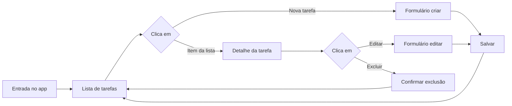

# Mapa da jornada do usuário – Sistema de Tarefas

A experiência principal do app é o **board Kanban** (estilo Trello). Ver [jornada-usuario-kanban.md](jornada-usuario-kanban.md) para a jornada detalhada do Kanban. Este documento descreve o fluxo original baseado em lista e rotas.

> **Nota:** Este doc descreve o fluxo legado (vista lista). O pipeline atual do sistema tem **5 status**: `open`, `queued`, `in_progress`, `done`, `rejected`.

## 1.1 Fluxo principal

## 1.2 Etapas da jornada

| Etapa | Ação do usuário        | Sistema            | Resultado esperado                                   |
| ----- | ---------------------- | ------------------ | ---------------------------------------------------- |
| 1     | Acessa a aplicação     | GET /api/tasks     | Lista de tarefas (título, status)                    |
| 2     | Clica em "Nova tarefa" | -                  | Formulário com título, status, conteúdo (Markdown)   |
| 3     | Preenche e salva       | POST /api/tasks    | Tarefa criada; volta à lista                         |
| 4     | Clica em uma tarefa    | GET /api/tasks/:id | Tela de detalhe com conteúdo em Markdown renderizado |
| 5     | Clica em "Editar"      | GET /api/tasks/:id | Formulário preenchido; ao salvar, PUT /api/tasks/:id |
| 6     | Clica em "Excluir"     | Confirmação        | DELETE /api/tasks/:id; volta à lista                 |

## 1.3 Regras e observações

- **Lista**: exibir título, status (Aberta / Na fila / Em progresso / Concluída / Rejeitada) e opcionalmente data de atualização.
- **Formulário**: título obrigatório; status (select); corpo em Markdown (textarea ou editor).
- **Detalhe**: conteúdo da tarefa deve ser exibido como Markdown renderizado (não apenas texto cru).
- **Exclusão**: sempre com confirmação (dialog/modal).
- **Feedback**: toasts ou snackbars para sucesso/erro em criar, editar e excluir.
